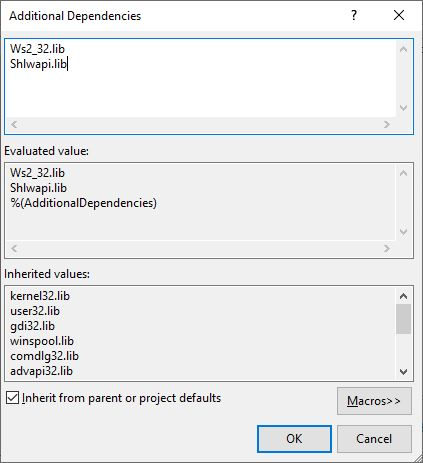

# hermes-ws
A very simple (and quite bad lol) barebones web server written in C. Utilizes the WinSock2 API.

## Features
- It doesn't crash
- Can serve static HTML + CSS pages

## Todo
- Cleanup code (Sort of done?...)
- Fix image serving (Seems to be working... kind of...)
- Implement an LRU cache (Works so far, needs tweaking)

## Build Steps
### Step 1:
Make sure that you're actually on a Windows machine, and have the latest version of Visual Studio installed.

### Step 2:
Clone the repo anywhere onto your system, and open it in Visual Studio.

### Step 3:
Once the solution has loaded, right click the `hermes-ws` project in the solution explorer, go into `Properties -> Configuration Properties -> Linker -> Input`. Click `Additional Dependencies`, click the down arrow that appears on the right, and click `Edit`. Add `Ws2_32.lib` and `Shlwapi.lib`, each on separate lines like so:

### Step 4:
Run the project :D